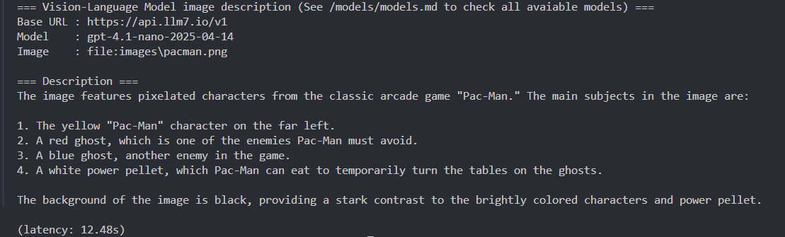

# Vision-Language Model Descriptions with llm7.io API

A minimal Python project showing how to use **Vision-Language Models (VLMs)** through the [llm7 API](https://api.llm7.io/).  
It loads an image (local file or URL), sends it along with a prompt, and prints the model’s output / answer to the given prompt + image.

---

> [!NOTE]
> I'm currently researching about LLMs and image processing, that's the reason behind making an specialized adaptation to work with images.

## ✨ Features
- Supports **text + image** input via the OpenAI-compatible llm7 API.
- Configuration via `config.yaml` (no hardcoded values).
- Works with multimodal models (see [models/models.md](models/models.md) for the full list).
- Local image files are automatically converted to **base64 data URLs**.

---

## ⚡ Setup

```bash
git clone https://github.com/edujbarrios/VLM_Descriptions_with_llm7.io_API.git
cd VLM_Descriptions_with_llm7.io_API

# Create virtual environment (optional but recommended)
python -m venv .venv
source .venv/bin/activate   # Linux/Mac
.venv\Scripts\activate      # Windows PowerShell

# Install dependencies
pip install -r requirements.txt
```
### About API Keys

By default, this API provider let's you use an `unused` value to don't use any specific key with a limited rate usage.

If you want **FREE** API keys for more usage rate limits, go to [https://token.llm7.io/](https://token.llm7.io/) (You must log in with Google).

---

## ⚙️ Configuration

1. **Check the available multimodal models** in [`models/models.md`](models/models.md).
2. Edit `config.yaml` and set your preferred model (must support both text + image).
3. Provide either a **local image path** or an **image URL** in the `image` section.

Example `config.yaml`:

```yaml
client:
  base_url: https://api.llm7.io/v1
  api_key: ${LLM7_API_KEY:unused}
  model: gpt-4.1-nano-2025-04-14

run:
  prompt: "Briefly describe what is in the image."
  temperature: 0.0

image:
  path: ./images/pacman.png
  # url: https://upload.wikimedia.org/wikipedia/commons/9/9a/Pug_600.jpg
```

---

## ▶️ Run

```bash
python describe_image.py
```

## 📸 Example

Here is an example run of the project:



---

## 📚 Notes
- Always use `https://api.llm7.io/v1` as the `base_url` (per official docs).
- If you see **405 Not Allowed**, double-check that your `base_url` is correct.
- Use only models that support **text + image** input (listed in [`models/models.md`](models/models.md)).

---

## 📜 License
MIT
